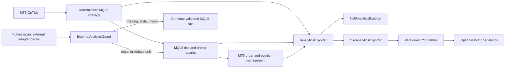

# MT5 Analytics-Ready Expert Advisor Architecture

This project keeps trading, broker validation, risk limits, and Strategy Tester execution entirely in MQL5. The optional Python project consumes exported records offline. Python is not required to run the EA, and an unavailable or malformed external response cannot disable MQL5 risk controls.

The included `AnalyticsIntegrationExample.mq5` is a deterministic integration example, not a claim of a profitable production strategy. It uses an EMA-trend/closed-bar-breakout rule only to demonstrate the full lifecycle, ATR stops, fixed-percentage sizing, daily loss enforcement, trade export, and tester compatibility. Replace that rule with a separately specified and tested strategy without changing the analytics interfaces.

For the staged path from this example to an operated production platform, see the [Enterprise Implementation Journey](docs/ENTERPRISE_JOURNEY.md).

## Architecture



The strategy depends on `IAnalyticsExporter`, not CSV. A future JSON, socket, ZeroMQ, or REST adapter can implement the same interface. Any network adapter must work asynchronously and expose only cached results to `OnTick`.

## Project layout

```text
MQL5/
├── Experts/
│   └── AnalyticsIntegrationExample.mq5
└── Include/
    ├── AnalyticsExporter.mqh
    └── ExternalAnalysis.mqh

PythonAnalytics/
├── README.md
├── requirements.txt
├── config.example.yaml
├── data/
├── notebooks/
├── reports/
├── tests/
└── src/
    ├── data_loader.py
    ├── schema.py
    ├── validation.py
    ├── feature_engineering.py
    ├── performance_metrics.py
    ├── trade_analysis.py
    ├── walk_forward.py
    ├── monte_carlo.py
    ├── regime_detection.py
    ├── parameter_stability.py
    ├── model_training.py
    ├── model_evaluation.py
    └── report_generator.py
```

## Operating modes

| Mode | Trades | Exports | External result |
|---|---:|---:|---|
| `MQL5_ONLY` | Yes | No; uses the no-op exporter | Ignored |
| `EXPORT_ONLY` | Yes | Yes | Ignored |
| `EXTERNAL_FILTER` | Yes | Yes | A valid cached result may reject or reduce risk only |
| `DRY_RUN_ANALYTICS` | No | Yes | Signals are evaluated and logged |

The example defaults to `EXPORT_ONLY`. With the included null external provider, `EXTERNAL_FILTER` safely follows the validated MQL5 decision and logs `NO_RESPONSE`; it never waits in `OnTick`.

The entry rule also requires minimum EMA separation, breakout displacement, and
confirmation-candle body size, each normalized by ATR. These quality filters are
configurable and reduce weak setups; they do not guarantee a higher win rate and
must be compared on unseen chronological test periods.

Before connecting a real provider, set a non-empty `InpExpectedModelVersion`. Available responses are rejected as invalid when no expected version is configured. `InpExternalTimeoutMs` is passed to the provider at initialization as its maximum asynchronous I/O budget; it is never implemented as a sleep in `OnTick`.

## Safety invariants

- Position size is calculated in MQL5 from equity, stop distance, tick size, tick value, and a configured risk percentage.
- Volume is rounded down. The EA rejects the order if the broker minimum volume would exceed the risk budget.
- Stop loss, take profit, broker stop distance, spread, free margin, allowed chart symbol, daily loss state, and existing positions are validated in MQL5. When realized plus floating strategy P/L reaches the daily limit, the EA enters its stopped state and attempts to close its own open position on every subsequent server-time update until closed.
- Trade closes are captured from MT5 transaction events, with tick-time and shutdown reconciliation fallbacks so a tester-generated final liquidation is exported after the last market tick.
- Only one position is allowed for the chart symbol. The example does not pyramid, use martingale, add to a loser, or place a trade after its daily stop is active.
- External `APPROVE` cannot convert a rejected MQL5 signal into an accepted one and cannot increase risk.
- `REDUCE_RISK` accepts only a multiplier strictly above zero and below one.
- Missing, late, stale, version-mismatched, unknown, or malformed external data falls back to the already-validated MQL5 rule.
- CSV open/write failures disable exporting after repeated errors; they do not stop or alter trading.
- `DRY_RUN_ANALYTICS` never calls the order API.

## Versioned export contract

`analytics_schema_version` is `1`. The exporter appends to three relational CSV streams. Every evaluated setup writes one snapshot and one decision—even when rejected. Later trade events use the same `setup_id`, allowing open/close information to arrive without mutating prior records.

| File | Cardinality | Purpose |
|---|---|---|
| `market_snapshots_v1.csv` | One row per evaluated setup | Prices, bar, volume, indicators, levels, session |
| `signal_decisions_v1.csv` | One row per evaluated setup | Setup mechanics, proposed risk, exact decision/reason, external result |
| `trade_events_v1.csv` | Zero or more rows per setup | Order rejection, open, and final closed-trade outcome |

Times use broker server time formatted as `YYYY.MM.DD HH:MM:SS`. MT5 does not attach a timezone offset; record the broker server/timezone alongside research datasets. Unavailable event timestamps are empty. Optional numeric setup values use `0` and categorical values use `NONE` in schema v1.

### `market_snapshots_v1.csv` fields

| Field | Type / unit | Meaning |
|---|---|---|
| `analytics_schema_version` | integer | Contract version; always `1` here. |
| `event_type` | text | Always `MARKET_SNAPSHOT`. |
| `setup_id` | text | Unique key joining all records for an evaluated setup. |
| `timestamp` | broker datetime | Closed entry-timeframe bar used for the decision. |
| `symbol` | text | Broker symbol evaluated. |
| `broker_server_time` | broker datetime | Server time when evaluation occurred. |
| `entry_timeframe` | MT5 enum text | Timeframe on which the entry setup was evaluated. |
| `trend_timeframe` | MT5 enum text | Timeframe used for trend indicators. |
| `bid` | price | Bid observed at evaluation. |
| `ask` | price | Ask observed at evaluation. |
| `spread_points` | symbol points | `(ask - bid) / point`. |
| `bar_open` | price | Confirmation/decision bar open. |
| `bar_high` | price | Confirmation/decision bar high. |
| `bar_low` | price | Confirmation/decision bar low. |
| `bar_close` | price | Confirmation/decision bar close. |
| `tick_volume` | ticks | MT5 tick volume for the closed bar. |
| `atr_points` | symbol points | ATR value divided by symbol point size. |
| `fast_ema` | price | Fast EMA on the configured trend timeframe. |
| `slow_ema` | price | Slow EMA on the configured trend timeframe. |
| `trend_classification` | text | Deterministic label such as `BULLISH`, `BEARISH`, or `NEUTRAL`. |
| `previous_day_high` | price | High of the previous completed broker D1 bar. |
| `previous_day_low` | price | Low of the previous completed broker D1 bar. |
| `asian_session_high` | price | Current broker-day high from 00:00 through 07:00, as available at decision time. |
| `asian_session_low` | price | Current broker-day low from 00:00 through 07:00, as available at decision time. |
| `detected_swing_high` | price | Most recent strategy-defined swing high; the example uses the highest of shifts 2–6. |
| `detected_swing_low` | price | Most recent strategy-defined swing low; the example uses the lowest of shifts 2–6. |
| `session_classification` | text | Broker-time session label: `ASIAN`, `LONDON`, `NEW_YORK`, or `OFF_HOURS`. |

### `signal_decisions_v1.csv` fields

| Field | Type / unit | Meaning |
|---|---|---|
| `analytics_schema_version` | integer | Contract version. |
| `event_type` | text | Always `SIGNAL_DECISION`. |
| `setup_id` | text | Joins to the corresponding snapshot and trade events. |
| `timestamp` | broker datetime | Decision timestamp. |
| `symbol` | text | Broker symbol evaluated. |
| `liquidity_level_type` | text | Type of level used, for example previous-day or recent-swing level. |
| `liquidity_level_price` | price | Exact liquidity/structure price used by the setup. |
| `sweep_direction` | text | `UP`, `DOWN`, or `NONE`. |
| `sweep_extreme` | price | Furthest price reached by the detected sweep; `0` if absent. |
| `sweep_confirmation_time` | broker datetime | Time the sweep was confirmed; empty if absent. |
| `bos_direction` | text | Break-of-Structure direction: `UP`, `DOWN`, or `NONE`. |
| `broken_structure_level` | price | Exact level broken by price. |
| `retest_price` | price | Price used for a retest; `0` if absent. |
| `retest_distance_points` | symbol points | Distance between retest and structure level. |
| `confirmation_open` | price | Confirmation candle open. |
| `confirmation_high` | price | Confirmation candle high. |
| `confirmation_low` | price | Confirmation candle low. |
| `confirmation_close` | price | Confirmation candle close. |
| `confirmation_body_points` | symbol points | Absolute candle-body size. |
| `confirmation_upper_wick_points` | symbol points | Upper-wick length. |
| `confirmation_lower_wick_points` | symbol points | Lower-wick length. |
| `confirmation_bullish` | boolean | Whether confirmation close exceeded open. |
| `proposed_entry_price` | price | Rule-based entry before execution. |
| `proposed_stop_loss_price` | price | Mandatory proposed protective stop. |
| `proposed_take_profit_price` | price | Proposed profit target. |
| `risk_points` | symbol points | Absolute entry-to-stop distance. |
| `reward_to_risk_ratio` | ratio | Proposed reward divided by risk. |
| `calculated_position_size` | lots | MQL5-calculated volume after all permitted reductions. |
| `strategy_state` | text | State reached by the deterministic state/risk machine. |
| `signal_accepted` | boolean | Final permission to place an order, or dry-run equivalent. |
| `rejection_reason` | text | Exact deterministic rejection reason; empty for accepted setups. |
| `external_available` | boolean | Whether a cached external result was available. |
| `external_quality_score` | number, 0–1 | External research score; informational unless filtering is enabled. |
| `external_model_version` | text | Version claimed by the external model. |
| `external_decision` | text | `APPROVE`, `REJECT`, `REDUCE_RISK`, or `NO_RESPONSE`. |
| `external_explanation` | text | Explanation or validation/fallback reason. |
| `external_generated_at` | broker datetime | Time claimed for the external result; empty when unavailable. |
| `external_decision_applied` | boolean | Whether a valid rejection or risk reduction actually changed execution. |
| `applied_risk_multiplier` | ratio, `(0,1]` | Final multiplier applied to MQL5 risk; never above one. |

### `trade_events_v1.csv` fields

| Field | Type / unit | Meaning |
|---|---|---|
| `analytics_schema_version` | integer | Contract version. |
| `event_type` | text | Always `TRADE_EVENT`. |
| `setup_id` | text | Links the trade lifecycle to its evaluated setup. |
| `timestamp` | broker datetime | Time of the order/trade event. |
| `symbol` | text | Broker symbol. |
| `trade_ticket` | integer | MT5 position ticket; `0` for an order rejected before a position existed. |
| `trade_event_type` | text | `OPENED`, `CLOSED`, `ORDER_REJECTED`, or future `MODIFIED`. |
| `final_trade_result` | text | `WIN`, `LOSS`, `BREAKEVEN`, `OPEN`, or `NOT_APPLICABLE`. |
| `profit_loss_money` | account currency | Net realized P/L recorded by MT5 for the exit deal, including its commission and swap. |
| `profit_loss_r` | R multiple | Net P/L divided by the MQL5 risk cash recorded at entry. |
| `maximum_favorable_excursion_points` | symbol points | Largest favorable marked price movement observed while open. |
| `maximum_adverse_excursion_points` | symbol points | Largest adverse marked price movement observed while open. |
| `slippage_points` | symbol points | Difference between proposed and actual entry where available. |
| `holding_duration_seconds` | seconds | Exit time minus entry time. |
| `exit_reason` | text | MT5-derived reason such as `STOP_LOSS`, `TAKE_PROFIT`, `EXPERT`, or a broker rejection. |
| `entry_price` | price | Actual entry price for opened/closed trades, or proposed price for rejected orders. |
| `exit_price` | price | Actual exit price for closed trades. |
| `volume` | lots | Executed or attempted volume. |

## Installing and testing in MetaTrader 5

1. Copy both `.mqh` files into the terminal's `MQL5/Include` directory.
2. Copy `AnalyticsIntegrationExample.mq5` into `MQL5/Experts`.
3. Compile the EA in MetaEditor.
4. Run it in the Strategy Tester first. Confirm symbol contract data, stops, fill policy, daily limit, and CSV output with the target broker.
5. CSV files are written under the terminal `MQL5/Files/Analytics` sandbox. If `InpUseCommonFiles=true`, they use the terminal common-files sandbox instead.

The exporter opens files for append and writes a header only when the file is empty. Archive files between materially different test runs or add run metadata in a later schema version.

Only one EA instance should write a given analytics directory at a time. Files permit concurrent readers but intentionally deny a second writer to prevent interleaved rows. Give parallel symbols/test agents separate directories, then combine validated tables offline.

## Adding a future external adapter

Implement `IExternalAnalysisProvider` in `ExternalAnalysis.mqh`. `TryGetLatest` must only read a local in-memory/cache value and return immediately. Perform file/socket/ZeroMQ/REST work outside the tick path—typically from a timer or another process—with a configured timeout. The guard validates availability, timestamp age, model version, decision vocabulary, score range, and risk multiplier.

Do not give the adapter direct access to order placement or the risk manager. It must never remove a stop, increase risk, bypass a daily stop, authorize another symbol, pyramid, or revive a stopped EA.

## Recommended development sequence

1. Replace the demonstration rule with the fully specified deterministic strategy.
2. Compile and test it in MT5 and the Strategy Tester without Python.
3. Validate CSV exports with `PythonAnalytics`.
4. Analyze descriptive performance and data quality.
5. Run chronological walk-forward and Monte Carlo research.
6. Investigate transparent regime labels and parameter stability.
7. Consider a model only with sufficient clean data and genuine cost-adjusted improvement on unseen periods.
8. Enable an external filter only after those tests, while retaining every MQL5 safety invariant.

Python, AI, and machine learning do not automatically improve profitability. Any filter must be compared out of sample after spread, slippage, commissions, and execution delay.

Performance reports include a configurable Wilson confidence interval around the
observed win rate. A wider interval means the dataset is too small to support a
precise accuracy claim; more independent closed trades narrow it.
