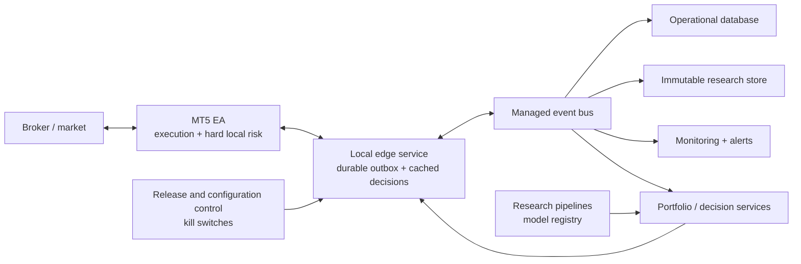

# Enterprise Implementation Journey

## Purpose

This journey turns the current analytics-ready MT5 example into an auditable, recoverable, and safely operated trading platform. It does not imply that the included demonstration strategy has a profitable edge. Strategy approval and platform readiness are separate gates, and both must pass before funded trading.

The target design keeps MT5 as a thin execution edge. Deterministic risk remains local to the EA, while research, durable storage, monitoring, release management, and optional model decisions live outside the terminal.

## Non-negotiable design rules

- MT5 remains the final authority for protective stops, broker validation, position sizing, exposure limits, and order placement.
- An external model may reject a trade or reduce risk. It may never create a locally rejected trade, increase risk, remove protection, or bypass a stopped state.
- No remote request blocks `OnTick`. MT5 consumes only a locally cached, validated response.
- Only one fenced execution instance may trade an account and strategy at a time.
- Broker positions, orders, and deals are authoritative for execution state. The event platform is authoritative for the audit history.
- Unknown risk state, failed reconciliation, invalid configuration, or ambiguous execution ownership fails closed.
- Research, demo, shadow, canary, and funded environments use separate accounts, credentials, data, and release approvals.
- CSV is an analytics export, not the production message transport or operational database.

## Journey overview

| Stage | Outcome | Trading permission |
|---|---|---|
| 0. Baseline | Reproducible build and test evidence | Strategy Tester only |
| 1. Execution hardening | Restart-safe and transaction-driven EA | Strategy Tester only |
| 2. Edge integration | Durable asynchronous transport and health | Demo only |
| 3. Data and observability | Complete audit trail, dashboards, and alerts | Demo only |
| 4. Research governance | Reproducible strategy/model promotion | Demo and shadow only |
| 5. Controlled release | Signed releases, canary rollout, and rollback | Limited live after approval |
| 6. Resilience | Fenced failover and disaster-recovery drills | Approved live scope |
| 7. Scale | Multi-account control and replaceable broker adapters | Approved portfolio scope |

Each stage is a gate. Calendar time, a profitable backtest, or completion of code alone does not waive its exit criteria.

## Stage 0 — Establish the baseline

### Build

- Pin the MetaTrader terminal and compiler build used for release evidence.
- Add a Windows CI job that compiles the EA and archives compiler output.
- Keep the Python environment reproducible and run its test suite in CI.
- Create deterministic Strategy Tester scenarios for long, short, rejected, stopped, and no-trade paths.
- Record the broker, symbol specification, account currency, leverage, spread model, commission, and testing-data range.
- Give every test run a run ID, source commit, configuration hash, schema version, and strategy version.

### Exit gate

- The EA compiles with zero errors and an explicitly reviewed warning policy.
- Python tests and deterministic tester scenarios pass from a clean checkout.
- A second operator can reproduce the same release artifacts and test report.
- The demonstration strategy is still clearly labelled non-production.

## Stage 1 — Harden execution and risk

### Build

- Replace lifecycle polling with an `OnTradeTransaction` state machine covering requests, orders, partial fills, deals, positions, closes, and broker rejections.
- Make every event idempotent; duplicate or out-of-order notifications must not duplicate state or orders.
- Persist a compact local execution journal containing instance ID, setup ID, request ID, order ID, deal ID, position ID, state, and sequence number.
- On startup, reconcile terminal state with broker positions, orders, and deal history before accepting a new setup.
- Recover ownership of an existing strategy position using the magic number and a versioned order comment.
- Add explicit checks for terminal trade permission, market/session state, symbol contract changes, price freshness, freeze levels, and account trading mode.
- Extend risk from per-trade controls to account and strategy exposure, total open risk, consecutive errors, and a persistent kill state.
- Separate failure policy for an unavailable optional model from failure of mandatory risk or reconciliation services.
- Ensure emergency-close behavior is idempotent and observable without repeatedly creating conflicting requests.

### Exit gate

- Restarting at every lifecycle point creates neither an orphan nor a duplicate order.
- Partial fills, rejection, requote, disconnect, and delayed transaction scenarios reconcile correctly.
- Network or analytics failure cannot increase risk.
- An unknown or inconsistent position state prevents new entries and raises an alert.
- Daily and account risk limits survive terminal and VM restarts.

## Stage 2 — Add the local edge service

### Build

- Run a supervised Windows service beside each isolated MT5 terminal.
- Replace CSV-as-transport with a framed, checksummed, append-only outbox carrying event IDs and monotonic per-instance sequence numbers.
- Acknowledge events only after durable local receipt; retry delivery with backoff and deduplication.
- Cache optional external decisions by setup ID, model version, generation time, expiry, and signature.
- Use mutual TLS for upstream communication and store credentials in the operating-system or cloud secret store.
- Emit terminal, EA, account, broker-session, queue-depth, last-tick, and last-transaction heartbeats.
- Keep CSV export as a human-readable diagnostic and research interface.

### Exit gate

- Disconnecting the upstream platform loses no events and does not block a tick.
- Replaying the outbox produces no duplicate operational records.
- Stale, malformed, mismatched, or unsigned decisions are rejected according to policy.
- Edge-service failure produces a clear alert and the documented safe EA behavior.

## Stage 3 — Build the data and observability platform

### Build

- Publish edge events to a durable managed stream or queue.
- Store current operational state in a transactional database and raw immutable events in object storage.
- Convert curated research datasets to a typed columnar format such as Parquet while preserving raw source events.
- Add schema compatibility checks and a dead-letter path for invalid events.
- Add UTC event time while preserving broker time, broker timezone metadata, and receive time.
- Include account alias, broker, symbol, strategy version, build commit, configuration hash, instance ID, correlation ID, event ID, and sequence number in schema v2.
- Instrument latency, missed bars, stale quotes, spread, risk rejection, order rejection, slippage, reconciliation, P/L, drawdown, and data-quality metrics.
- Alert on missing heartbeats, an unexpected open position, risk-limit activation, rejected close, stale data, event lag, schema rejection, and release drift.

### Exit gate

- Every broker deal can be traced to its setup, decision, risk calculation, request, release, and configuration.
- Operational state reconciles to broker state with zero unexplained differences over the acceptance window.
- Operators can diagnose a failed or missing trade using dashboards and structured events without logging into the VM.
- Alert delivery and escalation have been tested, acknowledged, and documented.

## Stage 4 — Govern research and optional models

### Build

- Version raw data, features, labels, costs, code, dependencies, configurations, and random seeds.
- Preserve chronological splits and fit every transformer only on its training fold.
- Require realistic spread, commission, swap, slippage, rejected orders, and execution-delay assumptions.
- Define the primary objective, risk constraints, minimum sample requirements, and acceptance thresholds before evaluation.
- Add walk-forward, parameter-stability, regime, Monte Carlo, capacity, and sensitivity reports.
- Register each approved strategy or model artifact with lineage, reviewer, expiry, and rollback target.
- Run new external decisions in shadow mode first. Compare them with the deterministic baseline without affecting orders.
- Monitor feature availability, data drift, decision distribution, calibration, realized cost, and performance decay.

### Exit gate

- Results reproduce from immutable inputs and a tagged source revision.
- The candidate improves the predeclared out-of-sample objective without violating tail-risk and stability limits.
- Shadow output is complete, timely, version-matched, and operationally reliable.
- Independent review approves promotion; the researcher cannot self-approve a funded release.

## Stage 5 — Control releases and live promotion

### Build

- Produce immutable, checksummed release bundles containing the compiled EA, edge service, schemas, configuration template, and release manifest.
- Require reviewed changes, protected branches, dependency and secret scanning, test evidence, and explicit release approval.
- Sign configurations and artifacts; the edge rejects an unapproved version or environment mismatch.
- Promote the same artifact through tester, demo, shadow, limited canary, and wider deployment.
- Define automated rollback triggers for reconciliation failure, release drift, repeated broker errors, telemetry loss, and risk-policy violation.
- Maintain operator runbooks for deploy, rollback, terminal restart, broker outage, stale prices, rejected close, certificate rotation, and kill-switch activation.

### Exit gate

- A canary can be stopped or rolled back without duplicate orders or lost state.
- Release, rollback, credential rotation, and kill-switch drills pass with retained evidence.
- Duties are separated for development, strategy approval, release approval, and production operation.
- Funded trading has explicit account, symbol, size, schedule, and maximum-loss authorization.

## Stage 6 — Add high availability and disaster recovery

### Build

- Use active-passive execution with a time-bounded lease and hard fencing; never allow two terminals to trade the same strategy scope.
- Replicate durable events and configuration independently of the execution VM.
- Require the passive instance to reconcile broker state before obtaining the execution lease.
- Back up operational metadata, audit events, release manifests, certificates, and runbooks with tested retention rules.
- Define recovery-time and recovery-point objectives and test regional, broker, platform, and credential failure scenarios.

### Exit gate

- Loss of the active VM cannot create concurrent execution.
- Failover with an open position preserves ownership, protection, and complete audit history.
- Restore and disaster-recovery drills meet the declared objectives.
- Operators can deliberately keep the platform stopped when safety cannot be established.

## Stage 7 — Scale without coupling to MT5

### Build

- Introduce account, portfolio, strategy, and broker adapter interfaces outside the EA.
- Allocate risk centrally while enforcing equal or stricter limits again at each execution edge.
- Partition events and operational ownership by account and strategy scope.
- Add capacity limits, correlated exposure, concentration, currency, and broker counterparty controls.
- Keep MT5 as one replaceable execution adapter; add FIX or broker-native gateways only behind the same command, risk, reconciliation, and audit contracts.
- Automate fleet inventory, release drift detection, certificate rotation, and per-account health reporting.

### Exit gate

- Adding an account or broker does not bypass approval, risk, reconciliation, monitoring, or audit controls.
- Failure of one account, terminal, broker adapter, or data partition does not corrupt another.
- Portfolio exposure matches approved allocations and independently reconciled broker state.

## Production readiness evidence

The final go-live packet should contain:

- Architecture and data-flow diagrams
- Threat model and access-control matrix
- Strategy specification and risk policy
- Source revision, build manifest, checksums, and signed configuration
- Compiler, automated test, Strategy Tester, demo, shadow, and canary reports
- Broker/symbol contract snapshot and cost assumptions
- Model card and lineage when an external model is enabled
- Reconciliation and data-quality report
- Load, disconnect, restart, duplicate-event, failover, and disaster-recovery results
- Monitoring inventory, alert routes, runbooks, rollback plan, and named approvers
- Explicit funded-account limits and documented residual risks

## Initial backlog for this repository

Work should begin in this order:

1. Add build/run metadata and schema v2 design.
2. Implement `OnTradeTransaction` lifecycle handling.
3. Implement startup reconciliation and persistent kill/risk state.
4. Add deterministic MQL5 tester scenarios and Windows compilation CI.
5. Define and implement the durable local outbox.
6. Build the supervised edge service and heartbeats.
7. Add central ingestion, immutable storage, dashboards, and alerts.
8. Run demo and failure-injection acceptance tests.
9. Add shadow-only external decision support and model governance.
10. Introduce signed releases, canary promotion, rollback, and fenced failover.

## Platform constraints behind the design

- MQL5 `WebRequest` is synchronous and is not available in the Strategy Tester, so remote calls do not belong on the tick path: <https://www.mql5.com/en/docs/network/webrequest>
- MQL5 file operations are restricted to terminal, testing-agent, or common-file sandboxes: <https://www.mql5.com/en/docs/files/fileopen>
- A trade request can generate multiple transaction events, and transaction arrival order is not guaranteed: <https://www.mql5.com/en/docs/event_handlers/ontradetransaction>
- MetaQuotes virtual hosting has no physical host access and does not allow DLLs, so a separately managed Windows VM is appropriate when a local edge service is required: <https://www.mql5.com/en/vps/rules>
- Secure build and release controls should align with an established framework such as NIST SSDF: <https://csrc.nist.gov/projects/ssdf>

This journey is an engineering and governance path, not financial advice or evidence of strategy profitability. No stage should be promoted solely because the preceding stage was completed.
